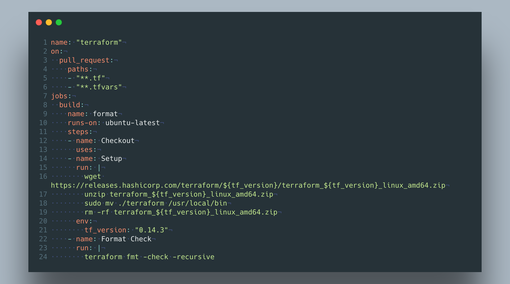

---
title: "terraform-fmt-with-github-actions"
date: 2021-02-15T16:00:00Z
draft: false
pin: true
summary: "A Simple github action to keep Terraform formated correctly"
tags: ["terraform", "actions"]
---

Explanation to come....

``` go
name: "terraform"
on:
  pull_request:
    paths:
    - "**.tf"
    - "**.tfvars"
jobs:
  build:
    name: format
    runs-on: ubuntu-latest
    steps:
    - name: Checkout
      uses:
    - name: Setup
      run: |
        wget https://releases.hashicorp.com/terraform/${tf_version}/terraform_${tf_version}_linux_amd64.zip
        unzip terraform_${tf_version}_linux_amd64.zip
        sudo mv ./terraform /usr/local/bin
        rm -rf terraform_${tf_version}_linux_amd64.zip
      env:
        tf_version: "0.14.3"
    - name: Format Check
      run: |
        terraform fmt -check -recursive
```





